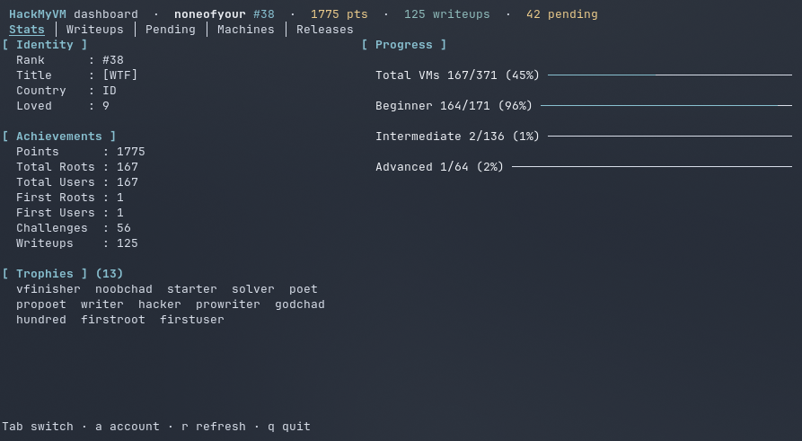
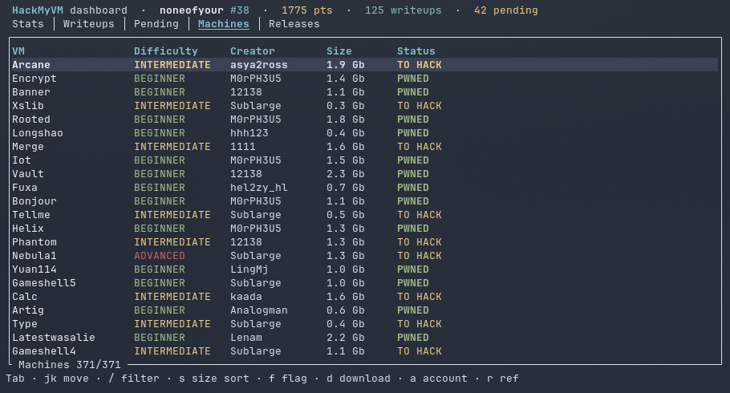

# HMV-TUI

### HackMyVM Advanced Versatile Operations Toolkit

<p><strong>English</strong> · <a href="README.es.md">Español</a></p>

<p align="center">
  
</p>

**HMV-TUI** is an interactive terminal dashboard for the [HackMyVM](https://hackmyvm.eu) community: browse the machine catalog, download VMs straight from MEGA, submit flags, read community writeups and publish your own — all without leaving the terminal.

One command, one screen: running `hmv` opens the dashboard. Written in pure **Rust**, shipped as a single static binary with no runtime dependencies.

> **v1.0.0** — HMV-TUI is now dashboard-only. The classic CLI subcommands were removed; everything lives in the dashboard, including account management (first-time setup, switching accounts, logout).

---

## Screenshots

| Stats | Machines |
| :---: | :---: |
|  |  |

Nord-themed interface, color-coded difficulties, live progress gauges and an account menu (`a`) for login, switching and logout.

---

## Features

* **One command** — `hmv` opens the dashboard: your stats, accepted writeups, pending writeups, the full machine catalog and downloads in one screen.
* **In-app account management** — first-run setup, account switching and logout via the account popup (`a`); credentials are validated with a real login before anything is stored.
* **Secure Auth** — the password lives in your OS vault (Secret Service on Linux, Credential Manager on Windows, Keychain on macOS) via `keyring`. Only the username and the last download folder touch `~/.hmv/config.json`.
* **Machine catalog** — 370+ machines with color-coded difficulty, instant `/` filtering (name, difficulty, creator, status) and size sorting (`s`: smallest ↔ largest).
* **High-speed downloader** — VMs stream directly from MEGA, up to **2 in parallel** (extras queue), decrypted on the fly (AES-128-CTR) and **integrity-verified with the MEGA per-chunk MAC** before leaving the `.part` staging file.
* **Flag submission** — dual user/root popup (`f`), both fields sent in parallel; status-aware (PWNED machines get a read-only box, DONE machines a "one remains" notice).
* **Writeups** — read community writeups (`w`) and submit your own (`u`) once both flags are in.
* **Release schedule** — upcoming HackMyVM machines with RELEASED / UPCOMING status.

---

## Prerequisites

* **OS**: Linux (primary target — **developed and tested on Arch Linux**), macOS and Windows builds are provided as release binaries.
* An active account on [HackMyVM](https://hackmyvm.eu/).
* A Secret Service provider on Linux (e.g. GNOME Keyring / KWallet) for credential storage.

---

## Installation

### 1. From a release binary (easiest)

Grab the archive for your platform from the [Releases](https://github.com/setyanoegraha/hmv-tui/releases) page, extract it, and put the `hmv` binary on your `PATH`:

| Platform | Archive |
| :--- | :--- |
| Linux x86_64 | `hmv-v1.0.1-x86_64-unknown-linux-gnu.tar.gz` |
| macOS Apple Silicon | `hmv-v1.0.1-aarch64-apple-darwin.tar.gz` |
| macOS Intel | `hmv-v1.0.1-x86_64-apple-darwin.tar.gz` |
| Windows x86_64 | `hmv-v1.0.1-x86_64-pc-windows-msvc.zip` |

```bash
tar xzf hmv-v1.0.1-x86_64-unknown-linux-gnu.tar.gz
install -m 755 hmv ~/.local/bin/hmv
```

> **Arch Linux** — HMV-TUI is developed and tested on Arch. The Linux release binary is built on Ubuntu, but runs on Arch out of the box; just make sure a Secret Service provider is installed for credential storage:
>
> ```bash
> sudo pacman -S --needed gnome-keyring
> ```

### 2. From source

```bash
git clone https://github.com/setyanoegraha/hmv-tui.git
cd hmv-tui
cargo install --path .
```

### 3. From git directly

```bash
cargo install --git https://github.com/setyanoegraha/hmv-tui.git
```

> Requires the Rust toolchain (1.85+): https://rustup.rs

---

## First Setup

Nothing to configure by hand — just run:

```bash
hmv
```

On the very first run (or when the stored password no longer works) the dashboard opens a **Configure HackMyVM** popup:

1. Type your HackMyVM **username**, then press `Tab` / `↓`.
2. Type your **password** (hidden as `•••`), then press `Enter`.

Credentials are validated with a real login **before** anything is saved. If the login fails, the popup reopens with your username kept; `Esc` quits the app.

---

## Usage Guide

Five keyboard-driven tabs — `Stats`, `Writeups`, `Pending`, `Machines` and `Releases`:

| Keys | Action |
| :--- | :--- |
| `Tab` / `←` `→` | Switch between tabs |
| `↑` `↓` / `j` `k` | Move selection |
| `g` / `Home` | Jump to the top of the list |
| `/` | Filter the current list (type to narrow, `Enter` keeps it, `Esc` clears & exits) |
| `a` | **Account popup** — shows the active account: `Enter` opens the login popup to switch accounts, `l` logs out, `Esc` closes |
| `s` | **Machines only** — cycle size sort: site order → smallest first → largest first |
| `f` | **Machines only** — flag popup with User & Root fields (fill one or both, sent in parallel). Results show in a popup (`✓ ACCEPTED` / `✗ REJECTED` per field); a data refresh runs after you close it. Status-aware: PWNED machines show a read-only "Already PWNED" box, machines with one flag in get a "one remains" notice. |
| `d` | **Machines only** — download popup: pick the destination folder (remembered across sessions, zsh-style `Tab` path completion included), MEGA link resolved automatically, streaming download with live progress in the Downloads overlay. MAC-verified before the file lands. |
| `w` | **Machines & Pending** — community writeups popup for the selected machine: `j`/`k` to select, `Enter` opens the link in your browser, `Esc` closes. |
| `u` | **Pending only** — submit a writeup URL for the pwned machine (result popup as well). |
| `o` | Toggle the **Downloads** overlay (live gauges, speed, final paths). Closing it never stops running downloads. |
| `c` | **In the Downloads overlay** — cancel the most recent active download (the staged `.part` file is cleaned). |
| `Enter` | Open the selected writeup link in your browser (**Writeups tab** and writeups popup). |
| `r` | Re-fetch all data |
| `q` / `Esc` / `Ctrl-C` | Quit (with active downloads, the first `q` lists them — press `q` again to abort). |

### Account Management

Press `a` anywhere in the dashboard:

- **`Enter` — switch account**: opens the login popup with the current username prefilled. Enter the new credentials; they are validated by a real login before replacing the stored account, and the dashboard reloads with the new profile.
- **`l` — logout**: removes the password from the system vault and the username from `~/.hmv/config.json` (your download-folder preference is kept), clears the dashboard and shows the login popup. Sign in with another account, or `Esc` to quit.
- Running downloads are never affected — they use public MEGA links, not your session.

Actions submitted from the TUI show their verdicts in a result popup that stays until dismissed (`User flag: ✓ ACCEPTED`, `Root flag: ✗ REJECTED`, ...) and trigger an automatic data refresh on close when your progress changed.

Downloads run in the background (max 2 in parallel, extra ones queue): the Downloads overlay shows live gauges, speed and the final path; downloads keep running when the overlay is closed; quitting while a download is active asks for a second `q`.

### Where Your Data Lives

- `~/.hmv/config.json` — your username and the last download folder. Nothing else.
- System vault — your password, under the `hmv-cli` service. Never on disk in plain text.

---

## Updating

```bash
cargo install --git https://github.com/setyanoegraha/hmv-tui.git --force
```

or simply download the latest release binary from the [Releases](https://github.com/setyanoegraha/hmv-tui/releases) page.

### Uninstallation & Cleanup

```bash
cargo uninstall hmv
```

HMV stores configuration in the `~/.hmv/` directory and the password in the system vault. Delete the folder (and the `hmv-cli` vault entry) to clear all local data:
- Linux: `~/.hmv`

---

## Security Notes

* No HackMyVM or MEGA credentials are ever sent to MEGA — public-file downloads use MEGA's anonymous API.
* Downloaded archives are AES-CTR decrypted in a streaming fashion and verified against the MEGA MAC embedded in the file key; corrupt/interrupted downloads are rejected and never leave a partial `.zip` behind.
* All traffic uses HTTPS (MEGA storage URLs are upgraded from `http://` to `https://`).

---

## Official Links

- Website: [hackmyvm.eu](https://hackmyvm.eu)
- Discord: [Official HackMyVM](https://discord.com/invite/DxDFQrJ)
- Legacy Python version: [hackmyvm-commandlineinterface](https://github.com/setyanoegraha/hackmyvm-commandlineinterface)

## Acknowledgements

A massive thanks and maximum respect to the HackMyVM community, the staff, and all the machine creators. This toolkit exists because of the incredible platform and community you've built for cybersecurity enthusiasts to learn, share, and grow.

MEGA crypto implementation ported from [mega.py](https://github.com/odwyersoftware/mega.py) (odwyersoftware).

---

Made with ❤️ by [Ouba](https://github.com/setyanoegraha).

*Happy Hacking on HackMyVM!*
